# MobileGPT Auto-Explorer 아키텍처

이 문서는 MobileGPT Auto-Explorer 시스템의 전체 아키텍처를 상세히 설명합니다.

---

## 목차

1. [시스템 개요](#1-시스템-개요)
2. [디렉토리 구조](#2-디렉토리-구조)
3. [핵심 클래스](#3-핵심-클래스)
4. [에이전트 파이프라인](#4-에이전트-파이프라인)
5. [메모리 시스템](#5-메모리-시스템)
6. [데이터 흐름](#6-데이터-흐름)
7. [탐색 알고리즘](#7-탐색-알고리즘)
   - [7.1 알고리즘 비교](#71-알고리즘-비교)
   - [7.2 DFS](#72-dfs-깊이-우선-탐색)
   - [7.3 BFS](#73-bfs-너비-우선-탐색)
   - [7.4 GREEDY_BFS](#74-greedy_bfs-탐욕-bfs-탐색)
   - [7.5 GREEDY_DFS](#75-greedy_dfs-탐욕-dfs-탐색)
   - [7.6 Multi-step 서브태스크 탐색](#76-multi-step-서브태스크-탐색)
   - [7.7 알고리즘 상세 비교 분석](#77-알고리즘-상세-비교-분석)
   - [7.8 Gmail 앱 탐색 예시](#78-gmail-앱-탐색-예시)
   - [7.9 알고리즘 종합 비교표](#79-알고리즘-종합-비교표)
   - [7.10 시나리오별 효율성 예측](#710-시나리오별-효율성-예측)
   - [7.11 실전 시나리오 예시](#711-실전-시나리오-예시)
   - [7.12 최종 추천](#712-최종-추천)
   - [7.13 하이브리드 전략 제안](#713-하이브리드-전략-제안-선택사항)
8. [통신 프로토콜](#8-통신-프로토콜)
9. [CSV 스키마](#9-csv-스키마)

---

## 1. 시스템 개요

### 1.1 MobileGPT란?

MobileGPT는 대규모 언어 모델(LLM)을 활용하여 모바일 앱의 복잡한 작업을 자동으로 수행하는 시스템입니다. 인간이 앱을 사용하는 인지 과정을 모방하여 작업을 학습하고 실행합니다.

### 1.2 4단계 인지 프로세스

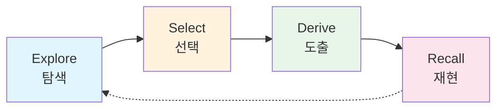

| 단계 | 설명 | 담당 에이전트 |
|------|------|--------------|
| **Explore** | 새로운 화면을 분석하여 가능한 동작(서브태스크) 발견 | ExploreAgent |
| **Select** | 사용자 목표에 맞는 최적의 서브태스크 선택 | SelectAgent |
| **Derive** | 서브태스크를 구체적인 UI 액션으로 변환 | DeriveAgent |
| **Recall** | 학습된 작업을 새로운 상황에 적응하여 재실행 | Memory System |

### 1.3 동작 모드

| 모드 | 서버 클래스 | 용도 |
|------|------------|------|
| **작업 모드** | `Server` | LangGraph 기반 사용자 명령 자동 수행 (기본값) |
| **수동 탐색** | `Explorer` | 사용자가 수동으로 화면을 캡처하여 탐색 |
| **자동 탐색** | `AutoExplorer` | 앱을 자동으로 탐색하여 UI 구조 학습 |

---

## 2. 디렉토리 구조

```
Server/
├── main.py                     # 메인 진입점, 환경변수 설정, CLI 파서
├── server.py                   # 작업 서버 (LangGraph 기반 사용자 명령 실행)
├── server_explore.py           # 수동 탐색 서버
├── server_auto_explore.py      # 자동 탐색 서버
│
├── agents/                     # 에이전트 모듈
│   ├── task_agent.py           # 명령어 파싱
│   ├── app_agent.py            # 앱 예측
│   ├── explore_agent.py        # 화면 탐색
│   ├── select_agent.py         # 서브태스크 선택
│   ├── derive_agent.py         # 액션 도출
│   ├── param_fill_agent.py     # 매개변수 채우기
│   ├── action_summarize_agent.py # 액션 요약
│   ├── usage_agent.py          # 사용법 생성
│   ├── subtask_merge_agent.py  # 서브태스크 병합
│   ├── verify_agent.py         # 다음 화면 검증
│   └── prompts/                # GPT 프롬프트 정의
│       ├── task_agent_prompt.py
│       ├── app_agent_prompt.py
│       ├── explore_agent_prompt.py
│       ├── select_agent_prompt.py
│       ├── derive_agent_prompt.py
│       └── ...
│
├── graphs/                     # LangGraph 워크플로우
│   ├── state.py                # TaskState, ExploreState 정의
│   ├── task_graph.py           # Task 실행 그래프
│   ├── explore_graph.py        # 자동 탐색 그래프
│   └── nodes/                  # 그래프 노드
│       ├── supervisor.py       # Supervisor 노드 (라우팅)
│       ├── memory_node.py      # Memory 노드 (page/state 조회)
│       ├── selector_node.py    # Selector 노드 (subtask 선택)
│       ├── verifier_node.py    # Verifier 노드 (다음 화면 검증)
│       └── deriver_node.py     # Deriver 노드 (action 도출)
│
├── handlers/                   # 메시지 핸들러
│   └── message_handlers.py     # 클라이언트 메시지 처리
│
├── memory/                     # 메모리 관리
│   ├── memory_manager.py       # 전체 메모리 관리
│   ├── page_manager.py         # 페이지별 관리
│   ├── node_manager.py         # 화면 구조 매칭
│   ├── state_manager.py        # 상태 관리
│   └── state_classifier.py     # 상태 분류
│
├── screenParser/               # XML 파서
│   ├── Encoder.py              # XML 인코딩
│   └── parseXML.py             # XML 파싱
│
└── utils/                      # 유틸리티
    ├── utils.py                # 공통 유틸리티
    ├── network.py              # 네트워크 유틸리티
    ├── action_utils.py         # 액션 유틸리티
    └── parsing_utils.py        # 파싱 유틸리티
```

---

## 3. 핵심 클래스

### 3.1 서버 클래스

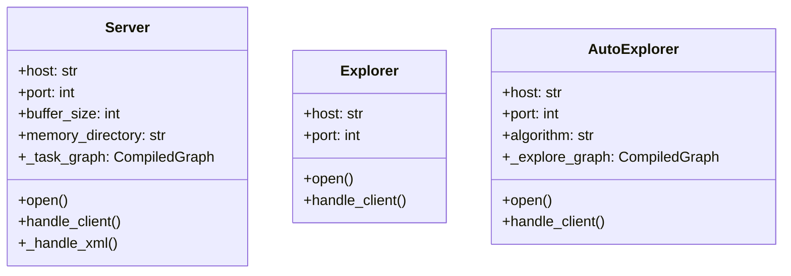

### 3.2 Server 클래스 (LangGraph 기반)

`server.py`에 정의된 LangGraph 기반 작업 서버입니다.

#### 핵심 메서드

```python
class Server:
    def __init__(
        self,
        host: str = '0.0.0.0',
        port: int = 12345,
        buffer_size: int = 4096,
        memory_directory: str = './memory'
    ):
        """LangGraph Task 그래프 초기화"""
        self._task_graph = compile_task_graph(checkpointer=True)

    def _handle_xml(
        self,
        client_socket: socket.socket,
        screen_parser: xmlEncoder,
        memory: Memory,
        instruction: str,
        session_id: str,
        log_directory: str,
        screen_count: int
    ) -> int:
        """XML 수신 → LangGraph Task Graph 실행 → action 반환

        자동으로 수행되는 흐름:
        1. Memory Node: page/state 조회
        2. Selector Node: subtask 선택
        3. Verifier Node: 다음 화면 검증
           - "가면 안된다" → 재선택 (Loop)
           - "간다" → 확정
        4. Deriver Node: action 도출
        """
```

#### Task 실행 흐름

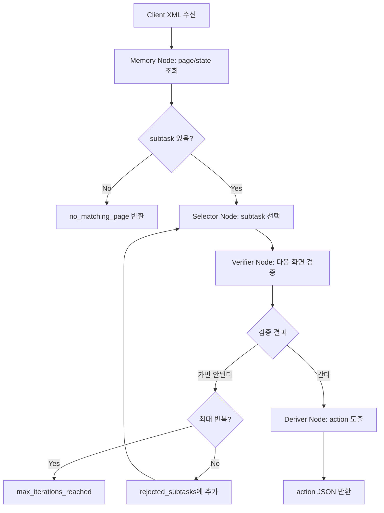

---

## 4. 에이전트 파이프라인

### 4.1 전체 파이프라인

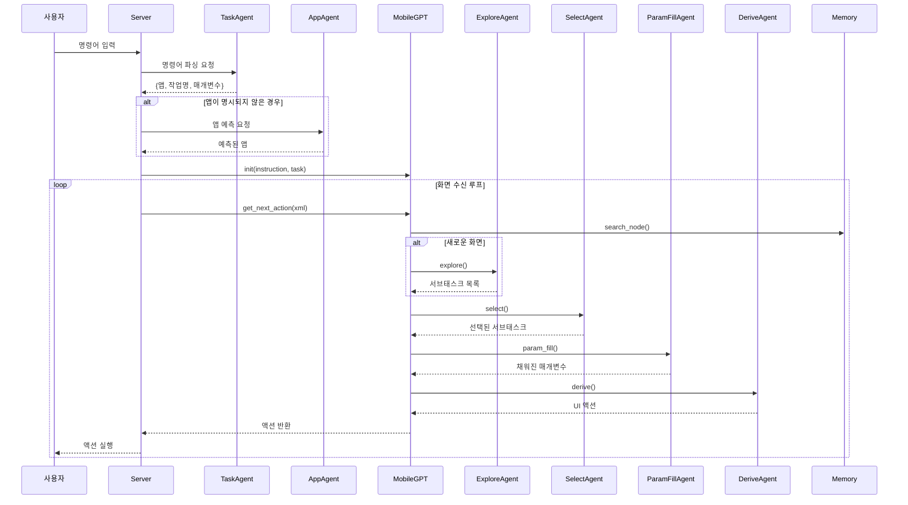

### 4.2 에이전트 상세

| 에이전트 | 파일 | 역할 | GPT 환경변수 |
|---------|------|------|-------------|
| **TaskAgent** | `task_agent.py` | 사용자 명령어를 구조화된 작업으로 변환 | `TASK_AGENT_GPT_VERSION` |
| **AppAgent** | `app_agent.py` | 명령어에서 대상 앱 예측 (임베딩 유사도 + GPT) | `APP_AGENT_GPT_VERSION` |
| **ExploreAgent** | `explore_agent.py` | 새 화면 분석, 서브태스크 발견 | `EXPLORE_AGENT_GPT_VERSION` |
| **SelectAgent** | `select_agent.py` | 목표에 맞는 서브태스크 선택 | `SELECT_AGENT_GPT_VERSION` |
| **ParamFillAgent** | `param_fill_agent.py` | 서브태스크 매개변수 자동 채우기 | `PARAMETER_FILLER_AGENT_GPT_VERSION` |
| **DeriveAgent** | `derive_agent.py` | 서브태스크를 구체적 UI 액션으로 변환 | `DERIVE_AGENT_GPT_VERSION` |
| **ActionSummarizeAgent** | `action_summarize_agent.py` | 실행된 액션 시퀀스를 1문장으로 요약 | `ACTION_SUMMARIZE_AGENT_GPT_VERSION` |
| **UsageAgent** | `usage_agent.py` | 서브태스크 사용법 설명 생성 | - |
| **SubtaskMergeAgent** | `subtask_merge_agent.py` | 중복 서브태스크 병합 | `SUBTASK_MERGE_AGENT_GPT_VERSION` |
| **GuidelineAgent** | `guideline_agent.py` | 서브태스크 UX 가이드라인 설명 생성 | `GUIDELINE_AGENT_GPT_VERSION` |
| **VerifyAgent** | `agents/verify_agent.py` | 선택한 subtask의 다음 화면 검증 | `VERIFY_AGENT_GPT_VERSION` |

### 4.3 에이전트 입출력

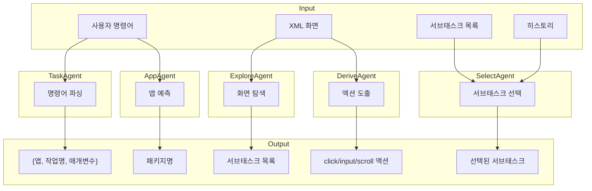

---

## 5. 메모리 시스템

### 5.1 클래스 구조

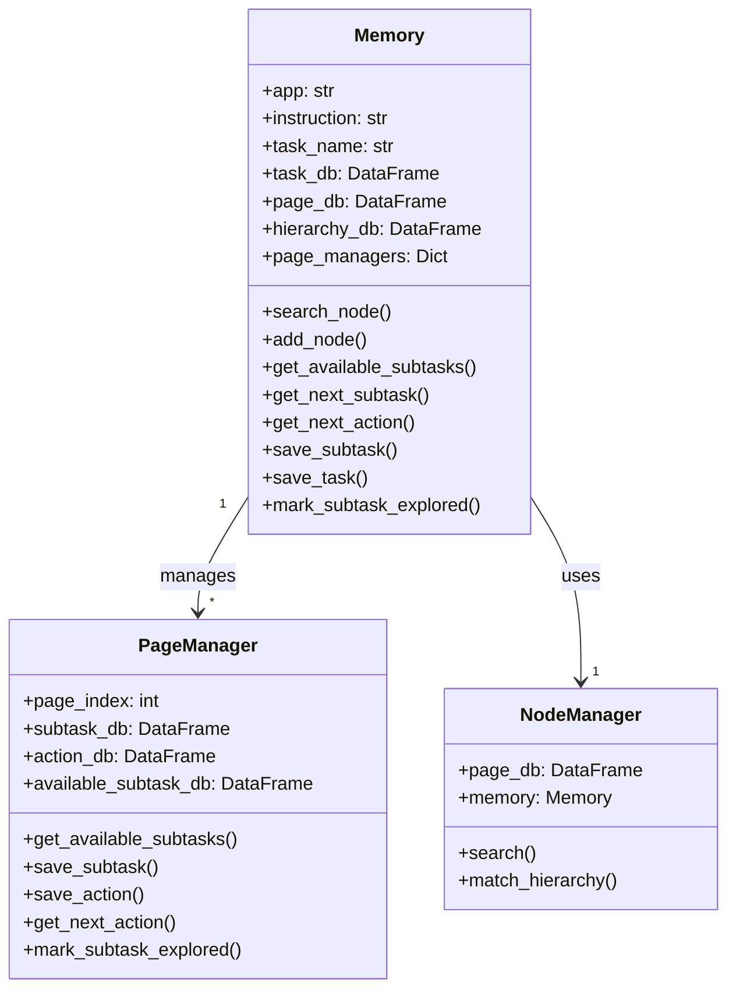

### 5.2 메모리 계층

```
memory/
├── apps.csv                    # 전체 앱 목록
├── tasks.csv                   # 전역 작업 목록
│
└── {앱_이름}/
    ├── tasks.csv               # 앱별 작업 경로
    ├── pages.csv               # 페이지(화면) 정보
    ├── hierarchy.csv           # 화면 임베딩 벡터
    │
    └── pages/
        └── {page_index}/
            ├── subtasks.csv        # 학습된 서브태스크
            ├── available_subtasks.csv  # 발견된 서브태스크
            ├── actions.csv         # 액션 시퀀스
            └── screen/             # 화면 캡처
                ├── screenshot.jpg
                ├── raw.xml
                ├── parsed.xml
                └── hierarchy.xml
```

### 5.3 화면 매칭 로직

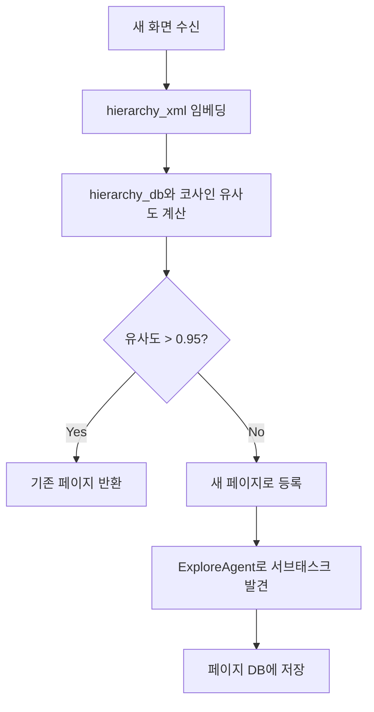

---

## 6. 데이터 흐름

### 6.1 기본 모드 (Server)

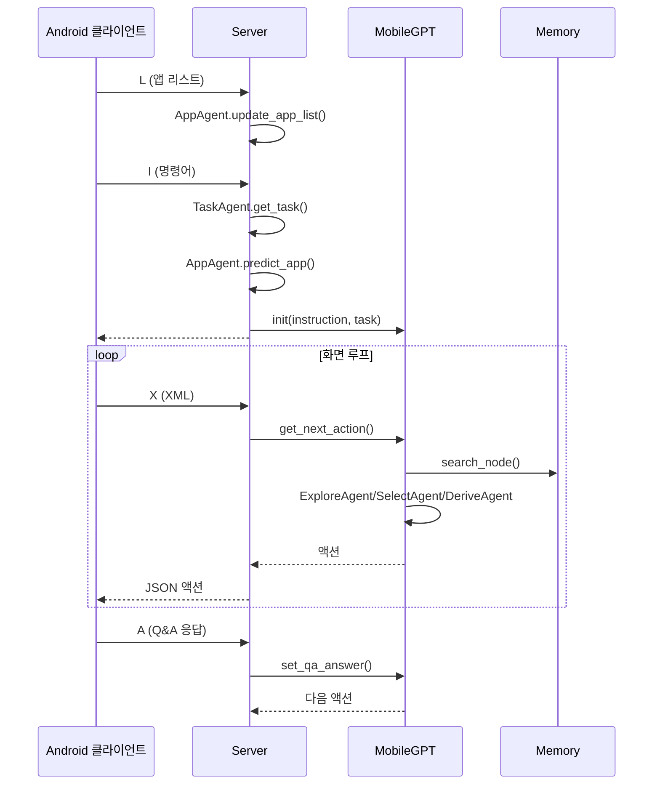

### 6.2 자동 탐색 모드 (Auto_Explorer)

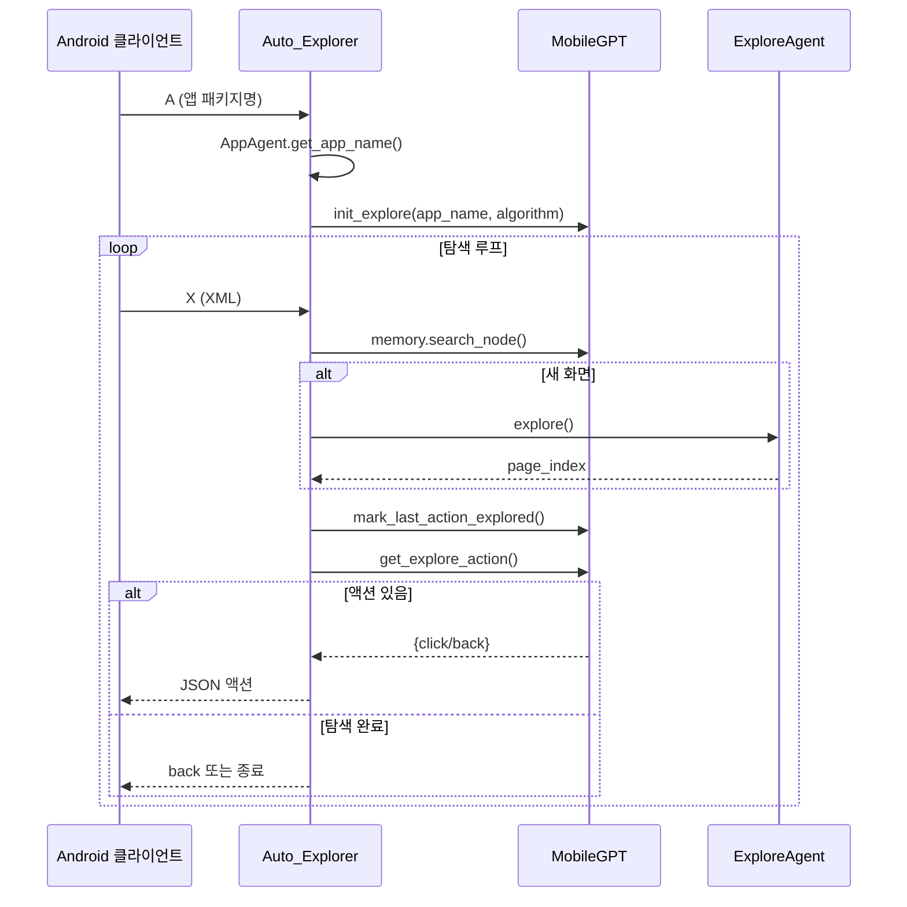

### 6.3 작업 모드 (Server with LangGraph)

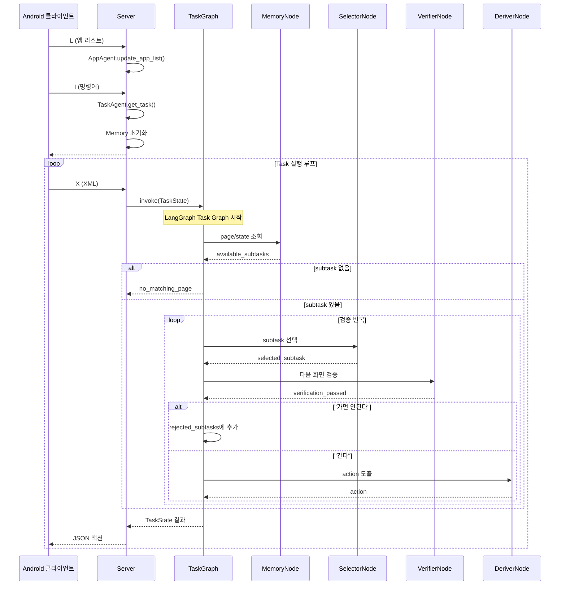

### 6.4 LangGraph Task Graph

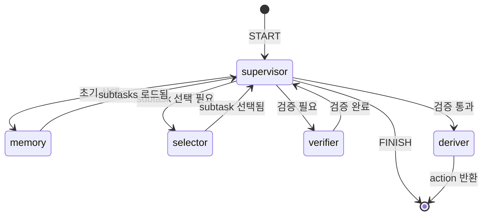

#### TaskState 구조

```python
class TaskState(TypedDict, total=False):
    """Task execution graph state."""

    # Session info
    session_id: str
    instruction: str

    # Memory reference (passed from server)
    memory: Any  # Memory instance

    # Current screen state
    page_index: int
    state_index: int
    current_xml: str
    hierarchy_xml: str
    encoded_xml: str

    # Subtask selection
    selected_subtask: dict | None
    rejected_subtasks: list[dict]  # Rejected subtasks (for reselection)
    available_subtasks: list[dict]

    # VerifyAgent results
    next_page_index: int | None
    next_state_index: int | None
    next_page_subtasks: list[dict]
    verification_passed: bool | None  # True: go, False: don't go, None: not verified

    # Routing
    next_agent: str

    # Result
    action: dict | None
    status: str
    iteration: int  # Reselection loop count
```

#### ExploreState 구조 (자동 탐색용)

```python
class ExploreState(TypedDict, total=False):
    """Exploration graph state."""

    # Session info
    session_id: str
    app_name: str
    algorithm: Literal["DFS", "BFS", "GREEDY_BFS", "GREEDY_DFS"]

    # Current screen state
    current_xml: str
    hierarchy_xml: str
    encoded_xml: str
    page_index: int
    state_index: int

    # Exploration state (persisted via MemorySaver)
    visited_pages: Set[Tuple[int, int]]  # (page, state) tuples
    exploration_stack: List  # DFS stack
    exploration_queue: List  # BFS queue
    page_graph: Dict  # Page connection graph
    back_edges: Dict  # Back action edges
    unexplored_subtasks: Dict  # {(page, state): [subtask_info, ...]}
    traversal_path: List  # Current path for backtracking

    # Memory and agents
    memory: Any
    explore_agent: Any

    # Routing and result
    next_node: str
    action: Optional[dict]
    status: str
    is_new_screen: bool
```

#### 노드별 역할

| 노드 | 역할 | 반환값 |
|------|------|--------|
| **supervisor** | 상태 기반 라우팅 결정 | `next_agent` |
| **memory** | page/state 조회, subtask 로드 | `page_index`, `available_subtasks` |
| **selector** | 거부된 subtask 제외 후 선택 | `selected_subtask` |
| **verifier** | LLM으로 다음 화면 검증 | `verification_passed` |
| **deriver** | 선택된 subtask의 action 도출 | `action` |

---

## 7. 탐색 알고리즘

### 7.1 알고리즘 비교

| 알고리즘 | 자료구조 | 특징 | 적합한 상황 |
|---------|---------|------|------------|
| **DFS** | 스택 | 한 경로를 끝까지 탐색 후 back으로 복귀 | 깊은 네비게이션 구조 |
| **BFS** | 큐 | 같은 레벨의 모든 UI 먼저 탐색 | 평면적인 앱 구조 |
| **GREEDY_BFS** | BFS + 거리 계산 | 가장 가까운 unexplored 서브태스크 우선 (최단 경로) | 최단 경로 중요, 이미 일부 탐색된 앱 |
| **GREEDY_DFS** | DFS + 깊이 계산 | 가장 깊은 unexplored 서브태스크 우선 (깊이 우선) | 깊이 우선 + 효율적 탐색 |

### 7.1.1 페이지 그래프 예제

아래 그래프는 앱의 페이지 구조를 나타냅니다:


**그래프 구조 설명:**

```
Start (시작 페이지)
├── 1 (edge 1)
│   ├── 4 (edge 4) ──→ 11 (edge 18, cross-link)
│   ├── 5 (edge 5)
│   └── 6 (edge 6) ──→ 3 (edge 17, cross-link)
├── 2 (edge 2)
│   ├── 10 (edge 10)
│   │   ├── 12 (edge 12)
│   │   ├── 13 (edge 13)
│   │   └── 14 (edge 14)
│   └── 11 (edge 11)
│       ├── 15 (edge 15)
│       └── 16 (edge 16)
└── 3 (edge 3)
    ├── 7 (edge 7)
    ├── 8 (edge 8)
    └── 9 (edge 9)
```

**Cross-link 특징:**
- **Edge 17** (6 → 3): 다른 브랜치로 연결 (설정 → 메인 메뉴)
- **Edge 18** (4 → 11): 다른 브랜치로 연결 (프로필 → 채팅)

### 7.1.2 알고리즘별 탐색 순서 비교

| 알고리즘 | 탐색 순서 | 총 이동 횟수 |
|---------|----------|-------------|
| **DFS** | Start → 1 → 4 → 11 → 15 → 16 → (back×2) → (back) → 5 → 6 → 3 → 7 → 8 → 9 → (back×4) → 2 → 10 → 12 → 13 → 14 | 클릭 16 + back 6 = 22 |
| **BFS** | Start → 1 → 2 → 3 → 4 → 5 → 6 → 10 → 11 → 7 → 8 → 9 → 12 → 13 → 14 → 15 → 16 | 클릭 16 + nav 15 = 31 |
| **GREEDY_BFS** | 현재 위치 기준 최단 거리 unexplored 우선 | 상황에 따라 변동 |
| **GREEDY_DFS** | 현재 위치 기준 최대 깊이 unexplored 우선 | 상황에 따라 변동 |

### 7.1.3 GREEDY 알고리즘 비교 시나리오

**시나리오**: Start에서 시작, 페이지 5, 10, 15만 unexplored 상태

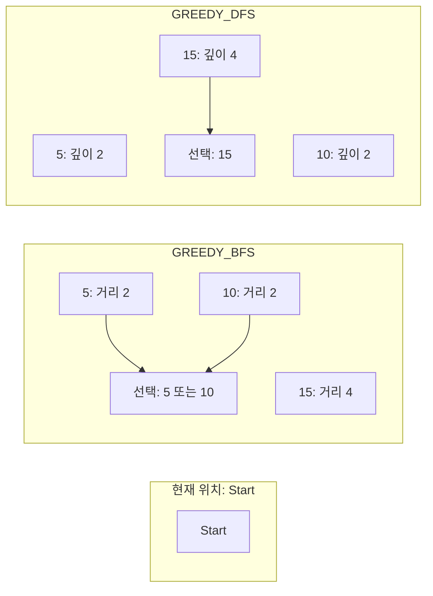

**GREEDY_BFS 동작:**
```
1. Start에서 BFS로 가장 가까운 unexplored 탐색
2. 5까지: Start → 1 → 5 (거리 2)
3. 10까지: Start → 2 → 10 (거리 2)
4. 15까지: Start → 2 → 11 → 15 (거리 4)
→ 거리가 같으면 먼저 발견된 5 선택
```

**GREEDY_DFS 동작:**
```
1. Start에서 DFS로 가장 깊은 unexplored 탐색
2. 5의 깊이: 2
3. 10의 깊이: 2
4. 15의 깊이: 4
→ 가장 깊은 15 선택, 경로: Start → 2 → 11 → 15
```

### 7.2 DFS (깊이 우선 탐색)

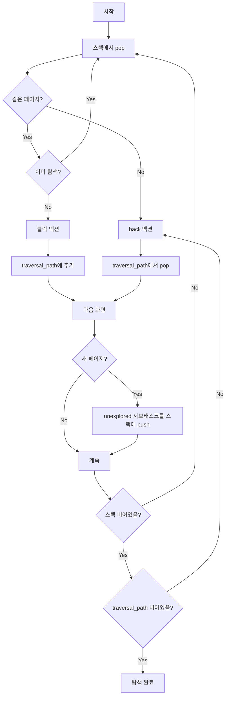

#### DFS 핵심 변수

```python
exploration_stack = []       # 탐색할 (page_index, subtask_info) 스택
traversal_path = []          # 현재 탐색 경로 (back 복귀용)
explored_subtasks = {}       # 페이지별 탐색 완료된 서브태스크
```

### 7.3 BFS (너비 우선 탐색)

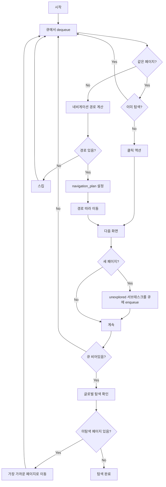

#### BFS 핵심 변수

```python
exploration_queue = []       # 탐색할 (page_index, subtask_info) 큐
page_graph = {}              # 페이지 간 연결 그래프 {from: [(to, subtask_name), ...]}
navigation_plan = []         # 네비게이션 계획 [(page, subtask), ...]
```

### 7.4 GREEDY_BFS (탐욕-BFS 탐색)

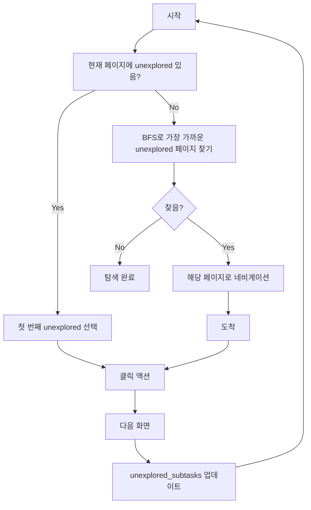

#### GREEDY_BFS 핵심 변수

```python
unexplored_subtasks = {}     # {page_index: [subtask_info, ...]}
page_graph = {}              # 페이지 간 연결 그래프
```

#### GREEDY_BFS 특징

- **BFS 기반 탐색**: 현재 페이지에서 가장 가까운 unexplored 서브태스크를 찾음
- **최단 경로 보장**: hop 수가 가장 적은 서브태스크를 우선 탐색
- **적합한 상황**: 평면적인 앱 구조, 탐색 비용 최소화가 중요한 경우

### 7.5 GREEDY_DFS (탐욕-DFS 탐색)


#### GREEDY_DFS 핵심 변수

```python
unexplored_subtasks = {}     # {page_index: [subtask_info, ...]}
page_graph = {}              # 페이지 간 연결 그래프
```

#### GREEDY_DFS 특징

- **DFS 기반 탐색**: 현재 페이지에서 가장 깊은 unexplored 서브태스크를 찾음
- **깊이 우선 탐색**: hop 수가 가장 많은 (가장 깊은) 서브태스크를 우선 탐색
- **적합한 상황**: 깊은 네비게이션 구조, 앱의 깊숙한 기능까지 빠르게 도달해야 할 때

#### _find_deepest_unexplored_info() 알고리즘

```python
def _find_deepest_unexplored_info(current_page):
    """DFS로 가장 깊은 unexplored 서브태스크 찾기"""
    # 1. 현재 페이지에 unexplored가 있으면 바로 반환
    if current_page in unexplored_subtasks and unexplored_subtasks[current_page]:
        return (current_page, subtask_info, [])

    # 2. DFS로 가장 깊은 unexplored 페이지 찾기
    stack = [(current_page, [], 0)]  # (page, path, depth)
    visited = {current_page}
    max_depth = -1
    deepest_result = (None, None, None)

    while stack:
        page, path, depth = stack.pop()
        for next_page, subtask_name in page_graph[page]:
            if next_page in visited:
                continue
            new_path = path + [(page, subtask_name)]
            new_depth = depth + 1

            # unexplored가 있고 더 깊은 경우 업데이트
            if next_page in unexplored_subtasks and unexplored_subtasks[next_page]:
                if new_depth > max_depth:
                    max_depth = new_depth
                    deepest_result = (next_page, subtask_info, new_path)

            visited.add(next_page)
            stack.append((next_page, new_path, new_depth))

    return deepest_result
```

### 7.6 Multi-step 서브태스크 탐색

복잡한 서브태스크는 여러 단계의 액션이 필요할 수 있습니다:

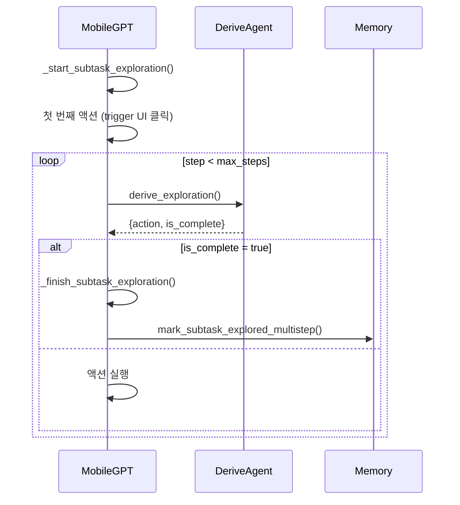

### 7.7 알고리즘 상세 비교 분석

#### 7.7.1 DFS (Depth-First Search, 깊이 우선 탐색)

**동작 원리**
- **스택(Stack) 기반**: LIFO (Last In First Out) 방식
- 한 경로를 끝까지 탐색한 후 `back` 버튼으로 되돌아가며 다른 경로 탐색
- 현재 페이지에서 unexplored UI를 클릭 → 새 페이지 도달 → 다시 그 페이지에서 깊이 탐색

**핵심 코드**
```python
self.exploration_stack = []      # (page_index, ui_index) 쌍을 저장
self.traversal_path = []         # 현재까지의 경로 (백트래킹용)

# 1. 스택에서 pop (가장 최근 추가된 것)
# 2. 목표 페이지와 현재 페이지가 다르면 'back' 액션 반환
# 3. 같으면 UI 클릭 후 경로에 추가
# 4. 스택이 비면 back으로 시작점까지 복귀
```

**장점**
- **메모리 효율적**: 스택만 유지하면 됨
- **경로 완전성**: 한 경로를 끝까지 탐색하므로 긴 시퀀스 발견에 유리
- **구현 단순**: 백트래킹 로직이 직관적 (`back` 버튼)

**단점**
- **글로벌 비효율**: 먼 페이지로 이동 시 긴 백트래킹 필요
- **중복 경로**: 같은 페이지에 여러 경로로 도달 가능 시 비효율적
- **순서 편향**: 스택 순서에 따라 특정 영역을 먼저 탐색

#### 7.7.2 BFS (Breadth-First Search, 너비 우선 탐색)

**동작 원리**
- **큐(Queue) 기반**: FIFO (First In First Out) 방식
- 같은 레벨(depth)의 모든 UI를 먼저 탐색
- **페이지 그래프 활용**: 목표 페이지로 최단 경로를 찾아 네비게이션
- 현재 페이지의 모든 unexplored UI를 큐에 추가 → 순서대로 처리

**핵심 코드**
```python
self.exploration_queue = []      # (page_index, ui_index) 큐
self.navigation_plan = []        # 최단 경로 계획
self.page_graph = {}             # {from_page: [(to_page, subtask), ...]}

# 1. 네비게이션 플랜 실행 중이면 계속 진행
# 2. 큐에서 dequeue (가장 먼저 추가된 것)
# 3. 목표 페이지와 현재 페이지가 다르면 _find_path_to_page() 호출
#    → BFS로 최단 경로 찾기
# 4. 네비게이션 플랜 따라 목표 페이지로 이동
# 5. UI 클릭 후 다음 큐 항목 처리
```

**장점**
- **레벨별 완전성**: 현재 레벨의 모든 노드를 먼저 탐색
- **최단 경로 네비게이션**: 페이지 그래프 활용으로 `back`보다 효율적
- **글로벌 최적화**: 멀리 떨어진 페이지도 최단 경로로 접근

**단점**
- **메모리 사용**: 큐 + 페이지 그래프 + 네비게이션 플랜 저장
- **초기 학습 필요**: 페이지 그래프를 구축해야 최단 경로 찾기 가능
- **네비게이션 복잡도**: 경로 계산 및 실행 로직이 복잡

#### 7.7.3 GREEDY (탐욕 알고리즘)

**동작 원리**
- **휴리스틱 기반**: 현재 위치에서 **가장 가까운** unexplored 서브태스크 우선 탐색
- **BFS 기반 거리 계산**: `_find_nearest_unexplored()` 함수로 최단 거리 페이지 찾기
- 로컬 최적화 → 글로벌 탐색 커버리지 목표

**핵심 코드**
```python
self.unexplored_subtasks = {}    # {page_index: [subtask_names]}
self.navigation_plan = []

# 1. 현재 페이지에 unexplored가 있으면 즉시 실행
# 2. 없으면 _find_nearest_unexplored() 호출
#    → BFS로 현재 페이지에서 가장 가까운 unexplored 페이지 찾기
# 3. 최단 경로로 네비게이션
# 4. 해당 페이지의 unexplored 실행
```

**`_find_nearest_unexplored()` 로직**
```python
# BFS로 페이지 그래프 탐색
# 현재 페이지에서 시작해 레벨별로 확장
# unexplored subtask가 있는 첫 번째 페이지 발견 시 최단 경로 반환
```

**장점**
- **커버리지 효율**: 가장 빠르게 모든 페이지 발견
- **네비게이션 최소화**: 항상 가장 가까운 타겟 선택
- **적응적**: 실시간으로 가장 효율적인 다음 단계 선택

**단점**
- **로컬 최적화 함정**: 전역 최적 경로가 아닐 수 있음
- **BFS 오버헤드**: 매번 최단 거리 계산 필요
- **예측 불가능**: 탐색 순서가 그래프 구조에 따라 크게 변동

### 7.8 Gmail 앱 탐색 예시

#### 7.8.1 단순한 그래프 (3개 페이지, 선형 구조)

```
페이지 0 (Inbox)
  ├─ open_email → 페이지 1 (Email Detail)
  │    └─ reply → 페이지 2 (Compose)
  └─ compose → 페이지 2 (Compose)
```

**DFS 탐색 순서**:
1. 페이지 0: "open_email" 클릭 → 페이지 1
2. 페이지 1: "reply" 클릭 → 페이지 2
3. 페이지 2: unexplored 모두 탐색
4. `back` → 페이지 1 → 다른 UI 탐색
5. `back` → 페이지 0 → "compose" 클릭 → 페이지 2

**총 액션**: 3 클릭 + 2 back = **5 액션**

**BFS 탐색 순서**:
1. 페이지 0: 모든 UI를 큐에 추가 → ["open_email", "compose"]
2. 큐에서 "open_email" dequeue → 페이지 1
3. 페이지 1: 모든 UI를 큐에 추가 → ["compose", "reply"]
4. 큐에서 "compose" dequeue
   - 현재 페이지 1, 목표 페이지 0 (compose는 페이지 0에서 실행)
   - 최단 경로 찾기: 페이지 1 → 페이지 0 (back 또는 home)
   - 페이지 0에서 "compose" 실행 → 페이지 2
5. 큐에서 "reply" dequeue
   - 현재 페이지 2, 목표 페이지 1
   - 최단 경로: 페이지 2 → 페이지 1 (back)
   - 페이지 1에서 "reply" 실행 → 페이지 2

**총 액션**: 3 클릭 + 2 네비게이션 = **5 액션** (DFS와 비슷)

**GREEDY 탐색 순서**:
1. 페이지 0: 현재 페이지에 unexplored 있음 → "open_email" 실행 → 페이지 1
2. 페이지 1: 현재 페이지에 unexplored 있음 → "reply" 실행 → 페이지 2
3. 페이지 2: unexplored 없음
   - 가장 가까운 unexplored 페이지 찾기 → 페이지 0 (거리 1)
   - 최단 경로: 페이지 2 → 페이지 0 (back × 2 또는 home)
   - 페이지 0에서 "compose" 실행 → 페이지 2

**총 액션**: 3 클릭 + 1 네비게이션 = **4 액션** (가장 효율적)

#### 7.8.2 복잡한 그래프 (10개 페이지, 그물망 구조)

```
페이지 0 (Inbox)
  ├─ open_drawer → 페이지 3 (Navigation Drawer)
  │    ├─ settings → 페이지 7 (Settings)
  │    │    └─ account → 페이지 9 (Account)
  │    └─ drafts → 페이지 4 (Drafts)
  ├─ search → 페이지 5 (Search)
  ├─ open_email → 페이지 1 (Email Detail)
  │    ├─ reply → 페이지 2 (Compose)
  │    └─ forward → 페이지 2 (Compose)
  └─ compose → 페이지 2 (Compose)
```

**DFS 탐색 순서** (스택에 추가된 순서대로):
1. 페이지 0: "open_drawer" → 페이지 3
2. 페이지 3: "settings" → 페이지 7
3. 페이지 7: "account" → 페이지 9
4. 페이지 9: 탐색 완료, `back` → 페이지 7
5. 페이지 7: `back` → 페이지 3
6. 페이지 3: "drafts" → 페이지 4
7. 페이지 4: `back` → 페이지 3
8. 페이지 3: `back` → 페이지 0
9. 페이지 0: "search" → 페이지 5
10. 페이지 5: `back` → 페이지 0
11. 페이지 0: "open_email" → 페이지 1
12. 페이지 1: "reply" → 페이지 2
13. 페이지 2: `back` → 페이지 1
14. 페이지 1: "forward" → 페이지 2 (이미 탐색한 페이지)
15. 페이지 2: `back` → 페이지 1 → `back` → 페이지 0
16. 페이지 0: "compose" → 페이지 2

**문제점**:
- 페이지 2에 3번 방문 (reply, forward, compose 경로)
- 총 16+ `back` 액션 필요 → **30+ 액션**

**BFS 탐색 순서** (레벨별):

**Level 0 (페이지 0의 모든 UI)**:
1. 큐: ["open_drawer", "search", "open_email", "compose"]
2. "open_drawer" → 페이지 3
3. "search" → 페이지 5 (최단 경로: 페이지 3 → 페이지 0 → 페이지 5)
4. "open_email" → 페이지 1
5. "compose" → 페이지 2

**Level 1 (페이지 3, 5, 1, 2의 모든 UI)**:
6. 페이지 3의 UI 큐에 추가: ["settings", "drafts"]
7. 페이지 1의 UI 큐에 추가: ["reply", "forward"]
8. "settings" → 페이지 7 (최단 경로: 현재 위치 → 페이지 3 → 페이지 7)
9. "drafts" → 페이지 4
10. "reply" → 페이지 2 (최단 경로: 현재 위치 → 페이지 1 → 페이지 2)
11. "forward" → 페이지 2

**Level 2 (페이지 7, 4의 모든 UI)**:
12. 페이지 7의 UI 큐에 추가: ["account"]
13. "account" → 페이지 9

**총 액션**: 13 클릭 + 약 8-10 네비게이션 = **21-23 액션**

**DFS 대비 개선**:
- 페이지 2 중복 방문 감소 (BFS는 같은 레벨에서 한 번만 방문)
- 최단 경로 네비게이션으로 불필요한 `back` 제거

**GREEDY 탐색 순서** (거리 우선):

1. 페이지 0: "open_drawer" (거리 0) → 페이지 3
2. 페이지 3: "settings" (거리 0) → 페이지 7
3. 페이지 7: "account" (거리 0) → 페이지 9
4. 페이지 9: unexplored 없음
   - 가장 가까운 unexplored: 페이지 3의 "drafts" (거리 2)
   - 네비게이션: 페이지 9 → 페이지 7 → 페이지 3
5. 페이지 3: "drafts" → 페이지 4
6. 페이지 4: unexplored 없음
   - 가장 가까운 unexplored: 페이지 0의 "search" (거리 2)
   - 네비게이션: 페이지 4 → 페이지 3 → 페이지 0
7. 페이지 0: "search" → 페이지 5
8. 페이지 5: unexplored 없음
   - 가장 가까운 unexplored: 페이지 0의 "open_email" (거리 1)
   - 네비게이션: 페이지 5 → 페이지 0
9. 페이지 0: "open_email" → 페이지 1
10. 페이지 1: "reply" (거리 0) → 페이지 2
11. 페이지 2: unexplored 없음
    - 가장 가까운 unexplored: 페이지 1의 "forward" (거리 1)
    - 네비게이션: 페이지 2 → 페이지 1
12. 페이지 1: "forward" → 페이지 2
13. 페이지 2: unexplored 없음
    - 가장 가까운 unexplored: 페이지 0의 "compose" (거리 2)
    - 네비게이션: 페이지 2 → 페이지 1 → 페이지 0
14. 페이지 0: "compose" → 페이지 2

**총 액션**: 14 클릭 + 약 10 네비게이션 = **24 액션**

**특이점**:
- DFS보다는 효율적이지만 BFS보다 약간 많을 수 있음
- 이유: 매번 가장 가까운 것만 선택 → 같은 영역을 여러 번 왕복

### 7.9 알고리즘 종합 비교표

| 특성 | DFS | BFS | GREEDY |
|------|-----|-----|--------|
| **자료구조** | Stack (LIFO) | Queue (FIFO) | Unexplored map + BFS |
| **탐색 순서** | 깊이 우선 (경로 완성) | 레벨 우선 (너비) | 거리 우선 (가장 가까운 것) |
| **네비게이션** | `back` 버튼만 사용 | 페이지 그래프 최단 경로 | 페이지 그래프 최단 경로 |
| **메모리 사용** | 낮음 (스택만) | 중간 (큐 + 그래프) | 중간 (unexplored map + 그래프) |
| **단순 그래프 효율** | ⭐⭐⭐ (5 액션) | ⭐⭐⭐ (5 액션) | ⭐⭐⭐⭐ (4 액션) |
| **복잡 그래프 효율** | ⭐ (30+ 액션) | ⭐⭐⭐⭐ (21-23 액션) | ⭐⭐⭐ (24 액션) |
| **구현 복잡도** | 낮음 | 높음 | 중간 |
| **중복 방문** | 많음 (같은 페이지 여러 경로) | 적음 (레벨별 한 번) | 중간 (거리에 따라) |
| **경로 완전성** | 높음 (긴 시퀀스 발견) | 중간 | 낮음 (로컬 최적화) |

### 7.10 시나리오별 효율성 예측

#### 7.10.1 복잡하지 않은 경우 (선형 또는 트리 구조)

**특징**:
- 페이지 수 ≤ 10
- 엣지 수가 적음 (각 페이지에서 1-3개 서브태스크)
- 순환 경로 거의 없음
- 예: 간단한 설정 앱, 메모 앱

**예측**:
1. **GREEDY** ⭐⭐⭐⭐⭐ (가장 효율적)
   - 거리 기반 선택으로 불필요한 이동 최소화
   - 작은 그래프에서 로컬 최적화 = 글로벌 최적화
   - 예상 액션: N × 1.2 (N = 노드 수)

2. **BFS** ⭐⭐⭐⭐
   - 레벨별 탐색으로 체계적
   - 네비게이션 오버헤드가 적음 (경로가 짧음)
   - 예상 액션: N × 1.3

3. **DFS** ⭐⭐⭐
   - 백트래킹 오버헤드
   - 선형 구조에서는 큰 차이 없음
   - 예상 액션: N × 1.5

**추천**: **GREEDY** - 가장 빠른 커버리지

#### 7.10.2 복잡한 경우 (그물망 구조)

**특징**:
- 페이지 수 > 20
- 엣지 수가 많음 (각 페이지에서 5-10개 서브태스크)
- 순환 경로 많음 (같은 페이지에 여러 경로로 도달)
- 예: Gmail, Facebook, Instagram

**예측**:
1. **BFS** ⭐⭐⭐⭐⭐ (가장 효율적)
   - 레벨별 탐색으로 중복 방문 최소화
   - 페이지 그래프 활용으로 최단 경로 네비게이션
   - 순환 경로 처리에 강함
   - 예상 액션: N × 1.5 ~ 2.0

2. **GREEDY** ⭐⭐⭐
   - 거리 기반 선택이 로컬 최적화 함정에 빠질 수 있음
   - 같은 영역을 여러 번 왕복할 가능성
   - 예상 액션: N × 2.0 ~ 2.5

3. **DFS** ⭐
   - 백트래킹 오버헤드가 심각
   - 같은 페이지를 여러 번 방문
   - 예상 액션: N × 3.0 ~ 5.0+

**추천**: **BFS** - 체계적 탐색 및 중복 최소화

### 7.11 실전 시나리오 예시

#### 시나리오 1: Gmail 앱 (복잡한 그래프)

**구조**:
- 30개 페이지
- 평균 7개 서브태스크/페이지
- Navigation Drawer로 모든 주요 페이지 연결
- 순환 경로 많음 (Compose ↔ Inbox, Settings ↔ Inbox 등)

**예상 결과**:
- **DFS**: 약 450 액션 (많은 백트래킹, 중복 방문)
- **BFS**: 약 60 액션 (레벨별 체계적 탐색)
- **GREEDY**: 약 80 액션 (거리 기반이지만 일부 비효율적 왕복)

**추천**: **BFS**

#### 시나리오 2: 메모 앱 (단순한 트리)

**구조**:
- 5개 페이지
- 평균 2개 서브태스크/페이지
- 트리 구조 (Home → List → Detail → Edit → Save)
- 순환 경로 없음

**예상 결과**:
- **DFS**: 약 8 액션 (백트래킹 적음)
- **BFS**: 약 7 액션 (레벨별 탐색)
- **GREEDY**: 약 6 액션 (가장 가까운 것 우선)

**추천**: **GREEDY**

### 7.12 최종 추천

#### 그래프 복잡도별 추천

| 그래프 특성 | 추천 알고리즘 | 이유 |
|-------------|--------------|------|
| **단순** (페이지 < 10, 엣지 < 30) | **GREEDY** | 거리 기반 선택으로 최소 액션 |
| **중간** (페이지 10-20, 엣지 30-100) | **BFS** 또는 **GREEDY** | 상황에 따라 선택 |
| **복잡** (페이지 > 20, 엣지 > 100) | **BFS** | 체계적 탐색, 중복 최소화 |
| **순환 많음** | **BFS** | 레벨별 탐색으로 순환 처리 강함 |
| **순환 없음** (트리) | **GREEDY** | 거리 = 최적, 빠른 커버리지 |

#### 현재 코드베이스 기본값

[main.py:39](Server/main.py#L39)에서 기본값은 **GREEDY_BFS**로 설정되어 있습니다.

```python
exploration_algorithm = "GREEDY_BFS"
```

**이유**: 대부분의 앱에서 최단 경로 탐색과 효율성의 균형을 제공합니다. 복잡한 앱(Gmail 등)에서는 **BFS**로 변경하는 것이 권장됩니다.

### 7.13 하이브리드 전략 제안 (선택사항)

더 나은 성능을 위해 **적응형 알고리즘**을 고려할 수 있습니다:

1. **초기 탐색 (0-20% 진행)**: **GREEDY**
   - 빠르게 주요 페이지 발견
   - 페이지 그래프 구축

2. **중기 탐색 (20-80% 진행)**: **BFS**
   - 체계적으로 모든 레벨 커버
   - 중복 방문 최소화

3. **말기 탐색 (80-100% 진행)**: **GREEDY**
   - 남은 unexplored를 가장 빠르게 완료

**예상 개선**: 복잡한 그래프에서 15-20% 액션 감소

---

## 8. 통신 프로토콜

### 8.1 메시지 타입

| 타입 | 방향 | 설명 | 데이터 형식 |
|------|------|------|------------|
| `L` | Client → Server | 앱 리스트 전송 | `패키지1##패키지2##...\n` |
| `I` | Client → Server | 사용자 명령어 | `명령어 문자열\n` |
| `A` | Client → Server | 앱 패키지명 (탐색 모드) | `패키지명\n` |
| `X` | Client → Server | XML 화면 구조 | `파일크기\n + XML데이터` |
| `S` | Client → Server | 스크린샷 이미지 | `파일크기\n + 이미지데이터` |
| `A` | Client → Server | Q&A 응답 | `info_name\question\answer\n` |
| `F` | Client → Server | 탐색 종료 | - |

### 8.2 액션 형식

서버에서 클라이언트로 전송하는 액션:

```json
// 클릭 액션
{
    "name": "click",
    "parameters": {
        "index": "5"
    }
}

// 입력 액션
{
    "name": "input",
    "parameters": {
        "index": "3",
        "text": "Hello World"
    }
}

// 스크롤 액션
{
    "name": "scroll",
    "parameters": {
        "index": "1",
        "direction": "down"
    }
}

// 뒤로 가기 액션
{
    "name": "back",
    "parameters": {}
}

// 음성 출력 액션
{
    "name": "speak",
    "parameters": {
        "message": "작업을 완료했습니다"
    }
}

// 질문 액션
{
    "name": "ask",
    "parameters": {
        "info_name": "recipient",
        "question": "누구에게 메시지를 보낼까요?"
    }
}
```

### 8.3 통신 흐름

```mermaid
sequenceDiagram
    participant App as Android App
    participant Server as Python Server

    Note over App,Server: 초기 연결
    App->>Server: TCP 연결
    App->>Server: L + 앱 리스트

    Note over App,Server: 명령 실행 모드
    App->>Server: I + 명령어
    Server-->>App: ##$$## + 패키지명

    loop 실행 루프
        App->>Server: S + 스크린샷
        App->>Server: X + XML
        Server-->>App: JSON 액션 + \r\n

        alt 질문 필요
            Server-->>App: ask 액션
            App->>Server: A + 응답
        end
    end

    Server-->>App: $$$$$ (종료 신호)
```

---

## 9. CSV 스키마

### 9.1 apps.csv

전체 앱 목록 및 임베딩 정보

| 컬럼 | 타입 | 설명 |
|------|------|------|
| `app_name` | string | 앱 표시 이름 |
| `package_name` | string | Android 패키지명 |
| `description` | string | 앱 설명 (Google Play에서 가져옴) |
| `embedding` | list[float] | 설명의 OpenAI 임베딩 벡터 |

### 9.2 tasks.csv (전역)

전역 작업 목록

| 컬럼 | 타입 | 설명 |
|------|------|------|
| `name` | string | 작업 이름 |
| `description` | string | 작업 설명 |
| `parameters` | json | 작업 매개변수 |
| `app` | string | 대상 앱 |

### 9.3 tasks.csv (앱별)

앱별 학습된 작업 경로

| 컬럼 | 타입 | 설명 |
|------|------|------|
| `name` | string | 작업 이름 |
| `path` | json | 페이지별 서브태스크 경로 `{page_index: [subtask_names]}` |

```json
// path 예시
{
    "0": ["search_contact"],
    "1": ["select_contact"],
    "2": ["input_message", "send"]
}
```

### 9.4 pages.csv

페이지(화면) 정보

| 컬럼 | 타입 | 설명 |
|------|------|------|
| `index` | int | 페이지 인덱스 |
| `available_subtasks` | json | 사용 가능한 서브태스크 목록 |
| `trigger_uis` | json | 서브태스크별 트리거 UI 정보 |
| `extra_uis` | json | 추가 UI 정보 |
| `screen` | string | 화면 XML |

```json
// trigger_uis 예시
{
    "search": [{"index": 5, "self": {"tag": "button", "text": "검색"}}],
    "settings": [{"index": 10, "self": {"tag": "button", "id": "settings_btn"}}]
}
```

### 9.5 hierarchy.csv

화면 계층 구조 임베딩 (유사도 검색용)

| 컬럼 | 타입 | 설명 |
|------|------|------|
| `index` | int | 페이지 인덱스 |
| `screen` | string | 계층 구조 XML |
| `embedding` | list[float] | OpenAI text-embedding-3-small 벡터 |

### 9.6 subtasks.csv

학습된 서브태스크 정보

| 컬럼 | 타입 | 설명 |
|------|------|------|
| `name` | string | 서브태스크 이름 |
| `start` | int | 시작 페이지 인덱스 |
| `end` | int | 종료 페이지 인덱스 |
| `description` | string | 서브태스크 설명 |
| `usage` | string | 사용법 설명 |
| `parameters` | json | 매개변수 정의 |
| `example` | json | 학습용 예시 |

### 9.7 available_subtasks.csv

발견된 서브태스크 및 탐색 상태

| 컬럼 | 타입 | 설명 |
|------|------|------|
| `name` | string | 서브태스크 이름 |
| `description` | string | 서브태스크 설명 |
| `parameters` | json | 매개변수 정의 |
| `exploration` | string | 탐색 상태: `explored` / `unexplored` |

### 9.8 actions.csv

서브태스크별 액션 시퀀스

| 컬럼 | 타입 | 설명 |
|------|------|------|
| `subtask_name` | string | 서브태스크 이름 |
| `trigger_ui_index` | int | 트리거 UI 인덱스 (경로 구분용) |
| `step` | int | 액션 순서 |
| `action` | json | 일반화된 액션 |
| `example` | json | 학습용 예시 |

```json
// action 예시 (일반화된 형태)
{
    "name": "input",
    "parameters": {
        "description": "검색 입력창",
        "text": "<query__-1>"  // 매개변수 참조
    }
}
```

---

## 부록: 환경 변수

`Server/main.py`에서 설정하는 환경 변수:

```python
# 에이전트별 GPT 모델 (GPT-5.2 계열)
os.environ["TASK_AGENT_GPT_VERSION"] = "gpt-5.2-chat-latest"
os.environ["APP_AGENT_GPT_VERSION"] = "gpt-5.2-chat-latest"
os.environ["EXPLORE_AGENT_GPT_VERSION"] = "gpt-5.2-chat-latest"
os.environ["SELECT_AGENT_GPT_VERSION"] = "gpt-5.2-chat-latest"
os.environ["SELECT_AGENT_HISTORY_GPT_VERSION"] = "gpt-5.2-chat-latest"
os.environ["DERIVE_AGENT_GPT_VERSION"] = "gpt-5.2-chat-latest"
os.environ["PARAMETER_FILLER_AGENT_GPT_VERSION"] = "gpt-5.2-chat-latest"
os.environ["ACTION_SUMMARIZE_AGENT_GPT_VERSION"] = "gpt-5.2-chat-latest"
os.environ["SUBTASK_MERGE_AGENT_GPT_VERSION"] = "gpt-5.2-chat-latest"
os.environ["GUIDELINE_AGENT_GPT_VERSION"] = "gpt-5.2-chat-latest"
os.environ["VERIFY_AGENT_GPT_VERSION"] = "gpt-5.2-chat-latest"  # LangGraph 검증 노드

# 기타 설정
os.environ["MOBILEGPT_USER_NAME"] = "user"
```

---

## 참고 문헌

- [MobileGPT: Augmenting LLM with Human-like App Memory for Mobile Task Automation](https://arxiv.org/abs/2312.03003)
