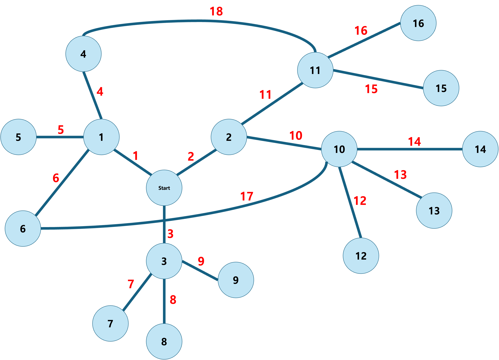

# MobileGPT - Auto Explorer

LLM 기반 모바일 작업 자동화 시스템

> [MobileGPT: Augmenting LLM with Human-like App Memory for Mobile Task Automation](https://arxiv.org/abs/2312.03003)

벤치마크 데이터셋: [Google Cloud 다운로드](https://drive.google.com/file/d/18Te3l0VtoxsZtEQYPTUylivVSqa-WBdG/view?usp=sharing)

---

## 개요

MobileGPT는 대규모 언어 모델(LLM)을 활용하여 모바일 앱의 복잡한 작업을 자동으로 수행하는 시스템입니다. 인간이 앱을 사용하는 인지 과정을 모방하여 4단계 프로세스로 작업을 학습하고 실행합니다:

1. **Explore (탐색)**: 새로운 화면을 분석하여 가능한 동작(서브태스크) 발견
2. **Select (선택)**: 사용자 목표에 맞는 최적의 서브태스크 선택
3. **Derive (도출)**: 서브태스크를 구체적인 UI 액션(클릭, 입력 등)으로 변환
4. **Recall (재현)**: 학습된 작업을 새로운 상황에 적응하여 재실행

### 주요 기능

- **작업 자동화**: 사용자 명령어를 이해하고 앱에서 자동으로 수행
- **메모리 기반 학습**: 한 번 수행한 작업을 저장하여 재사용
- **자동 탐색**: 앱 전체를 자동으로 탐색하여 UI 구조 학습
- **적응적 실행**: 학습된 작업을 다른 매개변수로 적응 실행

### 에이전트 파이프라인

```
┌─────────────────────────────────────────────────────────────────────────────┐
│                              사용자 명령어 입력                               │
└─────────────────────────────────────────────────────────────────────────────┘
                                       │
                                       ▼
┌─────────────────────────────────────────────────────────────────────────────┐
│  [TaskAgent]  명령어 파싱 → {앱, 작업명, 매개변수} 구조화                      │
└─────────────────────────────────────────────────────────────────────────────┘
                                       │
                                       ▼
┌─────────────────────────────────────────────────────────────────────────────┐
│  [AppAgent]  대상 앱 예측 (임베딩 유사도 + GPT 선택)                          │
└─────────────────────────────────────────────────────────────────────────────┘
                                       │
                                       ▼
                    ┌──────────────────────────────────────┐
                    │         화면 수신 루프 시작            │
                    └──────────────────────────────────────┘
                                       │
                                       ▼
┌─────────────────────────────────────────────────────────────────────────────┐
│  [ExploreAgent]  새 화면 분석 → 서브태스크 발견, 트리거 UI 추출                │
└─────────────────────────────────────────────────────────────────────────────┘
                                       │
                                       ▼
┌─────────────────────────────────────────────────────────────────────────────┐
│  [SelectAgent]  목표에 맞는 서브태스크 선택 (히스토리 + 화면 분석)              │
└─────────────────────────────────────────────────────────────────────────────┘
                                       │
                                       ▼
┌─────────────────────────────────────────────────────────────────────────────┐
│  [ParamFillAgent]  서브태스크 매개변수 채우기 (명령어/화면에서 추출)            │
└─────────────────────────────────────────────────────────────────────────────┘
                                       │
                                       ▼
┌─────────────────────────────────────────────────────────────────────────────┐
│  [DeriveAgent]  서브태스크 → 구체적 UI 액션 도출 (click, input, scroll 등)    │
└─────────────────────────────────────────────────────────────────────────────┘
                                       │
                                       ▼
┌─────────────────────────────────────────────────────────────────────────────┐
│  [ActionSummarizeAgent]  액션 시퀀스 요약 (1문장)                             │
│  [UsageAgent]  서브태스크 사용법 생성                                         │
│  [SubtaskMergeAgent]  중복 서브태스크 병합                                    │
└─────────────────────────────────────────────────────────────────────────────┘
                                       │
                                       ▼
                    ┌──────────────────────────────────────┐
                    │      액션 실행 → 다음 화면 수신        │
                    │      (작업 완료까지 루프 반복)         │
                    └──────────────────────────────────────┘
```

**에이전트 요약:**

| 에이전트 | 역할 | 입력 | 출력 |
|---------|------|------|------|
| **TaskAgent** | 명령어 파싱 | 사용자 명령 | {앱, 작업명, 매개변수} |
| **AppAgent** | 앱 예측 | 명령어 + 앱 목록 | 패키지명 |
| **ExploreAgent** | 화면 탐색 | XML 화면 | 서브태스크 목록 |
| **SelectAgent** | 서브태스크 선택 | 서브태스크들 + 히스토리 | 선택된 서브태스크 |
| **ParamFillAgent** | 매개변수 채우기 | 서브태스크 + 컨텍스트 | 채워진 매개변수 |
| **DeriveAgent** | 액션 도출 | 서브태스크 + 화면 | click/input 등 액션 |
| **ActionSummarizeAgent** | 액션 요약 | 액션 히스토리 | 1문장 요약 |
| **UsageAgent** | 사용법 생성 | 서브태스크 + 액션들 | 사용법 설명 |
| **SubtaskMergeAgent** | 서브태스크 병합 | 서브태스크 리스트 | 병합된 리스트 |

---

## Abstract

> The advent of large language models (LLMs) has opened up new opportunities in the field of mobile task automation. Their superior language understanding and reasoning capabilities allow users to automate complex and repetitive tasks. However, due to the inherent unreliability and high operational cost of LLMs, their practical applicability is quite limited. To address these issues, this paper introduces MobileGPT, an innovative LLM-based mobile task automator equipped with a human-like app memory. MobileGPT emulates the cognitive process of humans interacting with a mobile app—explore, select, derive, and recall. This approach allows for a more precise and efficient learning of a task's procedure by breaking it down into smaller, modular sub-tasks that can be re-used, re-arranged, and adapted for various objectives. We implement MobileGPT using online LLMs services (GPT-3.5 and GPT-4) and evaluate its performance on a dataset of 160 user instructions across 8 widely used mobile apps. The results indicate that MobileGPT can automate and learn new tasks with 82.5% accuracy, and is able to adapt them to different contexts with near perfect (98.75%) accuracy while reducing both latency and cost by 62.5% and 68.8%, respectively, compared to the GPT-4 powered baseline.

---

## 시스템 요구사항

- Python 3.12
- Android SDK >= 33
- OpenAI API Key
- Google Search API Key (선택사항)

---

## 설치

```bash
git clone https://github.com/mobile-gpt/MobileGPT.git
cd MobileGPT
pip install --upgrade pip
pip install -r ./Server/requirements.txt
```

---

## 서버 설정

### 1. API 키 설정

`Server/.env` 파일을 생성하고 API 키를 설정합니다:

```env
OPENAI_API_KEY = "<OpenAI API 키>"
GOOGLESEARCH_KEY = "<Google Search API 키 (선택)>"
```

### 2. GPT 모델 설정

`Server/main.py` 파일에서 각 에이전트가 사용할 GPT 모델을 설정할 수 있습니다.

#### 지원 모델

| 모델 | 용도 | 특징 |
|------|------|------|
| `gpt-5.2` | 최신 추론 모델 | 최고 성능, 높은 비용 (기본값) |
| `gpt-5` | 추론 모델 | 고성능, 복잡한 작업에 적합 |
| `gpt-4.1` | 범용 모델 | 균형잡힌 성능/비용 |
| `gpt-4.1-mini` | 경량 모델 | 빠른 응답, 저비용 |
| `gpt-4.1-nano` | 초경량 모델 | 최저 비용, 단순 작업에 적합 |

#### 에이전트별 모델 설정

```python
# 에이전트별 GPT 모델 버전
os.environ["TASK_AGENT_GPT_VERSION"] = "gpt-5.2"          # 사용자 명령 파싱
os.environ["APP_AGENT_GPT_VERSION"] = "gpt-5.2"           # 대상 앱 예측
os.environ["EXPLORE_AGENT_GPT_VERSION"] = "gpt-5.2"       # 화면 탐색/서브태스크 발견
os.environ["SELECT_AGENT_GPT_VERSION"] = "gpt-5.2"        # 서브태스크 선택
os.environ["SELECT_AGENT_HISTORY_GPT_VERSION"] = "gpt-5.2"# 히스토리 기반 선택
os.environ["DERIVE_AGENT_GPT_VERSION"] = "gpt-5.2"        # UI 액션 도출
os.environ["PARAMETER_FILLER_AGENT_GPT_VERSION"] = "gpt-5.2"  # 매개변수 채우기
os.environ["ACTION_SUMMARIZE_AGENT_GPT_VERSION"] = "gpt-5.2"  # 액션 요약
os.environ["SUBTASK_MERGE_AGENT_GPT_VERSION"] = "gpt-5.2" # 서브태스크 병합

# GPT 모델 별칭 (호환성용)
os.environ["gpt_5"] = "gpt-5.2"
os.environ["gpt_4"] = "gpt-4.1"
os.environ["gpt_4_turbo"] = "gpt-4.1"
os.environ["gpt_3_5_turbo"] = "gpt-4.1-mini"

# 비전 모델 (스크린샷 분석용)
os.environ["vision_model"] = "gpt-5.2"
os.environ["MOBILEGPT_USER_NAME"] = "user"
```

#### 비용 최적화 예시

비용을 줄이려면 단순 작업에 경량 모델을 사용할 수 있습니다:

```python
# 고성능이 필요한 에이전트
os.environ["EXPLORE_AGENT_GPT_VERSION"] = "gpt-5.2"
os.environ["SELECT_AGENT_GPT_VERSION"] = "gpt-5.2"
os.environ["DERIVE_AGENT_GPT_VERSION"] = "gpt-5.2"

# 단순 작업 에이전트 (비용 절감)
os.environ["ACTION_SUMMARIZE_AGENT_GPT_VERSION"] = "gpt-4.1-mini"
os.environ["SUBTASK_MERGE_AGENT_GPT_VERSION"] = "gpt-4.1-mini"
```

**환경 변수 요약:**

| 변수명 | 용도 | 기본값 |
|-------|------|-------|
| `TASK_AGENT_GPT_VERSION` | 사용자 명령을 구조화된 작업으로 변환 | gpt-5.2 |
| `APP_AGENT_GPT_VERSION` | 명령어에서 대상 앱 예측 | gpt-5.2 |
| `EXPLORE_AGENT_GPT_VERSION` | 새 화면 분석, 서브태스크 발견 | gpt-5.2 |
| `SELECT_AGENT_GPT_VERSION` | 목표에 맞는 서브태스크 선택 | gpt-5.2 |
| `SELECT_AGENT_HISTORY_GPT_VERSION` | 히스토리 기반 서브태스크 선택 | gpt-5.2 |
| `DERIVE_AGENT_GPT_VERSION` | 서브태스크를 UI 액션으로 변환 | gpt-5.2 |
| `PARAMETER_FILLER_AGENT_GPT_VERSION` | 서브태스크 매개변수 자동 채우기 | gpt-5.2 |
| `ACTION_SUMMARIZE_AGENT_GPT_VERSION` | 실행된 액션 시퀀스 요약 | gpt-5.2 |
| `SUBTASK_MERGE_AGENT_GPT_VERSION` | 중복 서브태스크 병합 | gpt-5.2 |

### 3. 서버 모드 선택

`Server/main.py`에서 실행할 서버 모드를 선택합니다:

```python
# 기본 모드: 사용자 명령 실행
mobilGPT_server = Server(host=server_ip, port=int(server_port), buffer_size=4096)

# 오프라인 탐색 모드: 수동 페이지 탐색
mobilGPT_explorer = Explorer(host=server_ip, port=int(server_port), buffer_size=4096)

# 자동 탐색 모드: 앱 자동 탐색
mobilGPT_auto_explorer = Auto_Explorer(host=server_ip, port=int(server_port), buffer_size=4096)
```

---

## 서버 실행

```bash
cd Server
python ./main.py

# 출력 예시:
# Server is listening on 192.168.0.100:12345
# 이 IP 주소를 앱에 입력하세요: [192.168.0.100]
```

---

## 클라이언트 앱

프로젝트에는 3가지 Android 앱이 포함되어 있습니다:

| 앱 | 용도 | 설명 |
|---|------|------|
| `App/` | 기본 MobileGPT | 사용자 명령 실행 |
| `App_Explorer/` | 수동 탐색 | 페이지를 수동으로 캡처하여 탐색 |
| `App_Auto_Explorer/` | 자동 탐색 | 앱을 자동으로 탐색 |

### 앱 설정

각 앱의 `MobileGPTGlobal.java` 파일에서 서버 IP를 설정합니다:

```java
// 서버의 IP 주소로 변경
public static final String HOST_IP = "192.168.0.100";
```

**파일 위치:**
- `App/app/src/main/java/com/example/MobileGPT/MobileGPTGlobal.java`
- `App_Explorer/app/src/main/java/com/example/hardcode/MobileGPTGlobal.java`
- `App_Auto_Explorer/app/src/main/java/com/example/hardcode/MobileGPTGlobal.java`

---

## 실행 방법

### 기본 모드 (사용자 명령 실행)

1. 서버가 실행 중인지 확인
2. MobileGPT 앱을 처음 실행하면 접근성 서비스 권한을 요청합니다
   - 설정에서 MobileGPT 앱의 접근성 서비스를 활성화
3. 앱이 설치된 앱 목록을 분석합니다 (최초 1회, 시간 소요)
4. 명령어를 입력하고 [Set New Instruction] 버튼을 클릭
5. MobileGPT가 자동으로 앱을 실행하고 작업을 수행합니다


### 오프라인 탐색 모드

1. `Server/main.py`에서 `Explorer` 서버 활성화
2. `App_Explorer` 앱 설치 및 실행
3. 화면 우측의 녹색 플로팅 버튼 확인
4. 탐색할 앱을 실행하고 Start 버튼 클릭
5. 원하는 페이지에서 Capture 버튼 클릭
6. 탐색 완료 후 Finish 버튼 클릭
7. 서버가 캡처된 페이지를 분석하여 메모리 생성

### 자동 탐색 모드

1. `Server/main.py`에서 `Auto_Explorer` 서버 활성화
2. `App_Auto_Explorer` 앱 설치 및 실행
3. 탐색할 앱을 선택하면 자동으로 모든 UI 탐색

#### 탐색 알고리즘 선택

`Server/main.py`에서 탐색 알고리즘을 선택할 수 있습니다:

```python
# 탐색 알고리즘 선택: "DFS", "BFS", "GREEDY_BFS", "GREEDY_DFS"
exploration_algorithm = "DFS"

mobilGPT_explorer = Auto_Explorer(
    host=server_ip,
    port=int(server_port),
    buffer_size=4096,
    algorithm=exploration_algorithm
)
```

| 알고리즘 | 특징 | 적합한 상황 |
|---------|------|------------|
| **DFS** | 깊이 우선 탐색, 한 경로를 끝까지 탐색 후 back으로 복귀 | 깊은 네비게이션 구조, 메모리 효율적 |
| **BFS** | 너비 우선 탐색, 같은 레벨의 모든 UI 먼저 탐색 | 평면적인 앱 구조, 체계적 탐색 |
| **GREEDY_BFS** | BFS로 가장 가까운 unexplored 서브태스크 우선 탐색 | 최단 경로 중요, 이미 일부 탐색된 앱 |
| **GREEDY_DFS** | DFS로 가장 깊은 unexplored 서브태스크 우선 탐색 | 깊이 우선 + 효율적 탐색 |

**알고리즘 상세:**

- **DFS (깊이 우선 탐색)**: 스택 기반으로 동작하며, 한 경로를 끝까지 탐색한 후 back 액션으로 복귀합니다. 메모리 효율적이고 깊은 네비게이션 구조에 적합합니다.

- **BFS (너비 우선 탐색)**: 큐 기반으로 동작하며, 같은 레벨의 모든 서브태스크를 먼저 탐색합니다. 다른 페이지로 이동이 필요한 경우 네비게이션 시스템(`subtasks.csv`의 `start`/`end` 컬럼)을 사용합니다.

- **GREEDY_BFS (탐욕-BFS 탐색)**: `available_subtasks.csv`의 `exploration` 컬럼을 활용합니다. 현재 위치에서 **BFS로 가장 가까운** `unexplored` 상태의 서브태스크를 찾아 탐색합니다. 최단 경로를 보장하며, 이미 일부 탐색이 완료된 앱의 추가 탐색에 효율적입니다.

- **GREEDY_DFS (탐욕-DFS 탐색)**: `available_subtasks.csv`의 `exploration` 컬럼을 활용합니다. 현재 위치에서 **DFS로 가장 깊은** `unexplored` 상태의 서브태스크를 찾아 탐색합니다. 깊은 경로를 우선 탐색하며, 앱의 깊숙한 기능까지 빠르게 도달해야 할 때 유용합니다.

> **참고**: 모든 알고리즘은 `available_subtasks.csv`의 `exploration` 상태(`explored`/`unexplored`)를 기반으로 탐색 여부를 결정합니다.

#### 탐색 순서 예제

아래 페이지 그래프를 기준으로 각 알고리즘의 탐색 순서를 비교합니다:



**그래프 구조:**
- **Start**: 시작 페이지
- **노드 1~16**: 앱의 각 페이지
- **빨간 숫자**: 엣지 번호 (서브태스크)
- **파란 선**: 페이지 간 이동 경로

**알고리즘별 탐색 순서 (모든 노드가 unexplored인 상태에서 시작):**

| 알고리즘 | 탐색 순서 | 총 이동 |
|---------|----------|--------|
| **DFS** | Start → 1 → 4 → 11 → 15 → 16 → (back×3) → 5 → 6 → 3 → 7 → 8 → 9 → (back×4) → 2 → 10 → 12 → 13 → 14 | 클릭 16 + back 7 = **23** |
| **BFS** | Start → 1 → 2 → 3 → 4 → 5 → 6 → 10 → 11 → 7 → 8 → 9 → 12 → 13 → 14 → 15 → 16 | 클릭 16 + nav ~15 = **~31** |
| **GREEDY_BFS** | Start → 1 → 4 → 5 → 6 → (nav) → 2 → 10 → 11 → 12 → 13 → 14 → (nav) → 3 → 7 → 8 → 9 → (nav) → 15 → 16 | 클릭 16 + nav ~10 = **~26** |
| **GREEDY_DFS** | Start → 1 → 4 → 11 → 15 → 16 → (nav) → 5 → 6 → 3 → 7 → 8 → 9 → (nav) → 2 → 10 → 12 → 13 → 14 | 클릭 16 + nav ~6 = **~22** |

**예시 시나리오** (Start에서 시작, 페이지 5, 10, 15가 unexplored):

```
현재 위치: Start

GREEDY_BFS 선택:
  - 5까지 거리: 2 (Start → 1 → 5)
  - 10까지 거리: 2 (Start → 2 → 10)
  - 15까지 거리: 4 (Start → 2 → 11 → 15)
  → 가장 가까운 5 또는 10 선택

GREEDY_DFS 선택:
  - 5의 깊이: 2
  - 10의 깊이: 2
  - 15의 깊이: 4
  → 가장 깊은 15 선택
```

---

## 메모리 구조

MobileGPT는 학습한 내용을 `Server/memory/` 폴더에 저장합니다:

```
memory/
├── apps.csv                   # 전체 앱 목록 (이름, 패키지, 설명, 임베딩)
├── {앱_이름}/
│   ├── tasks.csv              # 학습된 작업 목록 및 실행 경로
│   ├── pages.csv              # 페이지(화면) 정보 및 서브태스크
│   ├── hierarchy.csv          # 화면 계층 구조 + OpenAI 임베딩 벡터
│   └── pages/
│       ├── 0/                 # 페이지 0
│       │   ├── subtasks.csv       # 학습된 서브태스크 (사용법 포함)
│       │   ├── available_subtasks.csv  # 발견된 서브태스크 (탐색 상태)
│       │   ├── actions.csv        # 일반화된 액션 시퀀스
│       │   └── screen/            # 화면 캡처
│       │       ├── screenshot.jpg
│       │       ├── raw.xml
│       │       ├── parsed.xml
│       │       ├── html.xml
│       │       └── hierarchy.xml
│       ├── 1/                 # 페이지 1
│       └── ...
└── log/                       # 실행 로그
    └── {앱_이름}/{작업명}/{타임스탬프}/
        ├── screenshots/       # 스크린샷
        └── xmls/              # XML 화면 구조
```

### 메모리 관리 클래스

| 클래스 | 파일 | 역할 |
|-------|------|------|
| **Memory** | `memory_manager.py` | 전체 메모리 관리, 작업/페이지 DB |
| **PageManager** | `page_manager.py` | 페이지별 서브태스크/액션 관리 |
| **NodeManager** | `node_manager.py` | 화면 구조 매칭, 유사 페이지 검색 |

### CSV 스키마

**tasks.csv** - 학습된 작업 경로
```csv
name,path
send_message,"{\"0\": [\"search_contact\"], \"1\": [\"select_contact\"], \"2\": [\"input_message\", \"send\"]}"
```

**pages.csv** - 페이지 정보
```csv
index,available_subtasks,trigger_uis,extra_uis,screen
0,"[{\"name\":\"search\",\"description\":\"검색\",\"parameters\":{}}]","{\"search\":[{\"index\":5}]}","[{\"index\":10}]","<xml>..."
```

**hierarchy.csv** - 화면 임베딩 (유사도 검색용)
```csv
index,screen,embedding
0,"<hierarchy_xml>","[0.123, -0.456, ...]"  # OpenAI text-embedding-3-small 벡터
```

**subtasks.csv** - 학습된 서브태스크
```csv
name,start,end,description,usage,parameters,example
search_contact,0,1,연락처 검색,검색 버튼 클릭 후 이름 입력,"{\"query\":\"검색할 이름\"}","{\"query\":\"John\"}"
```

> **참고**: `start`와 `end`는 서브태스크 수행 전/후의 페이지 인덱스를 나타냅니다. 동일한 값일 수 있습니다 (화면 전환이 없는 경우).

**actions.csv** - 일반화된 액션
```csv
subtask_name,step,action,example
search_contact,0,"{\"name\":\"click\",\"parameters\":{\"description\":\"검색\"}}","{}"
search_contact,1,"{\"name\":\"input\",\"parameters\":{\"text\":\"<query__-1>\"}}","{\"query\":\"John\"}"
```

---

## 로그 확인

실행 중 서버 콘솔에 다음과 같은 로그가 출력됩니다:

- **파란색**: Explore, Select, Derive 단계 진행
- **노란색**: GPT 입력 프롬프트
- **초록색**: GPT 출력 응답

---

## 주의사항

- **연구용 소프트웨어**: 예상치 못한 동작(자동 결제, 계정 해지 등)이 발생할 수 있으므로 주의하세요.
- **API 비용**: 작업당 평균 약 $0.13 (약 13k 토큰) 소요됩니다.
- **메모리 수정**: `Server/memory/` 폴더에서 학습된 내용을 수동으로 수정할 수 있습니다.
- **언어 설정**: 스마트폰 언어를 영어로 설정하는 것을 권장합니다.

---

## 벤치마크 데이터셋

### 데이터셋 구조

```
Benchmark Dataset/
├── <app1>/
│   ├── <task1>/
│   │   ├── user_instruction1.json
│   │   └── user_instruction2.json
│   ├── <task2>/
│   │   └── ...
│   ├── Screenshots/
│   │   └── <index>.png
│   └── Xmls/
│       └── <index>.xml
├── <app2>/
└── ...
```

**포함된 앱**: YT Music, Uber Eats, Twitter, TripAdvisor, Telegram, Microsoft To-Do, Google Dialer, Gmail

### JSON 구조

```json
{
    "instruction": "<사용자 명령어>",
    "steps": [
        {
            "step": "<단계 번호>",
            "HTML representation": "<HTML 형식 화면 표현>",
            "action": {
                "name": "<액션 이름>",
                "args": {
                    "index": "<UI 인덱스>"
                }
            },
            "screenshot": "<스크린샷 파일명>",
            "xml": "<XML 파일명>"
        }
    ]
}
```

---

## 아키텍처

상세한 시스템 아키텍처는 [ARCHITECTURE.md](ARCHITECTURE.md)를 참조하세요.

---

## 라이선스

이 프로젝트는 연구 목적으로 제공됩니다.
