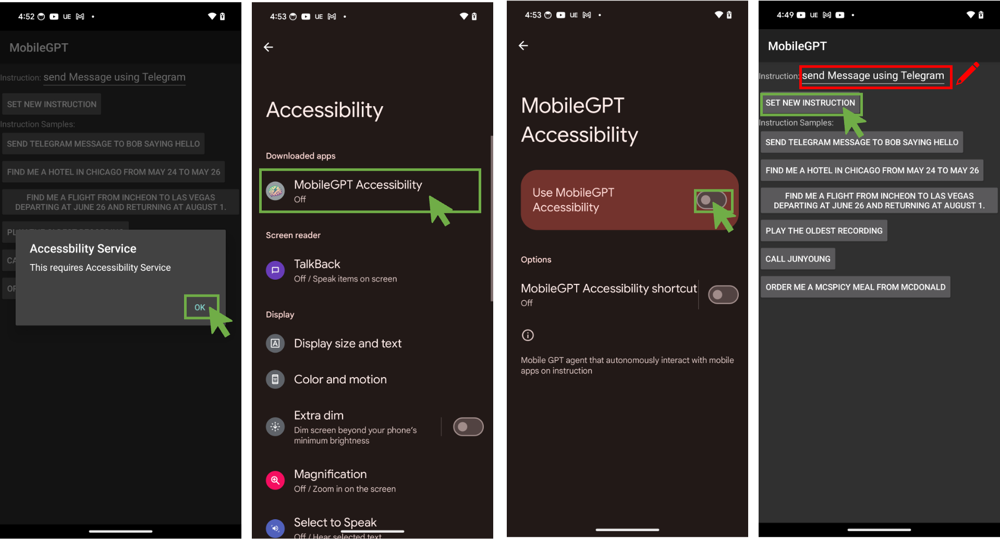

# MobileGPT-V2

LangGraph 기반 다중 에이전트 모바일 자동화 프레임워크



## 소개

MobileGPT-V2는 Android 기기에서 복잡한 태스크를 자동으로 수행하는 지능형 자동화 시스템입니다. LLM 기반 다중 에이전트와 LangGraph 워크플로우를 활용하여 앱 UI를 학습하고, 최적의 경로를 계획하며, 사용자 지시를 실행합니다.

### 핵심 가치

- **자동 학습**: UI 탐색을 통해 앱 구조를 자동으로 학습
- **지능형 계획**: Page Transition Graph (PTG) 기반 최적 경로 계획
- **적응형 실행**: 예상치 못한 상황에서 자동 재계획
- **안전한 탐색**: 가드레일로 위험한 액션 자동 필터링

---

## 핵심 프로세스: 6단계 파이프라인

```
Auto-Explore → Plan → Select → Derive → Verify → Recall
```

| 단계 | 역할 | 설명 |
|------|------|------|
| **Auto-Explore** | 앱 탐색 및 학습 | UI를 자동 탐색하여 페이지, subtask, 액션을 학습하고 PTG 구축 |
| **Plan** | 경로 계획 | PTG 기반 BFS로 목표까지의 최적 subtask 경로 계획 (UICompass) |
| **Select** | Subtask 선택 | planned_path에서 다음 subtask 선택 또는 LLM 기반 선택 |
| **Derive** | 액션 도출 | 선택된 subtask를 구체적인 UI 액션으로 변환 |
| **Verify** | 결과 검증 | 액션 결과 검증, 필요시 SKIP/REPLAN 결정 |
| **Recall** | 메모리 회상 | 현재 화면에서 학습된 정보 로드 및 매칭 |

---

## 주요 기능

### 6단계 지능형 태스크 실행
- LangGraph 기반 상태 머신으로 복잡한 태스크 처리
- Supervisor 노드가 상태에 따라 적절한 에이전트로 라우팅

### UICompass 스타일 경로 계획 (PTG)
- Page Transition Graph로 앱의 페이지 간 전이 관계 저장
- BFS 알고리즘으로 목표까지 최단 경로 탐색
- 학습된 액션 시퀀스 재사용으로 효율적 실행

### 적응형 재계획 (Adaptive Replanning)
- 예상 페이지와 실제 페이지 비교로 경로 검증
- PROCEED (정상 진행) / SKIP (건너뛰기) / REPLAN (재계획) 결정
- 최대 5회 재계획으로 강건한 실행

### 4가지 탐색 알고리즘
- **DFS**: 깊이 우선 탐색, 스택 기반
- **BFS**: 너비 우선 탐색, 큐 기반
- **GREEDY_BFS**: 최근접 미탐색 subtask로 BFS
- **GREEDY_DFS**: 최근접 미탐색 subtask로 DFS

### Auto-Explore 가드레일
자동 탐색 중 위험한 액션을 자동으로 필터링:

| 분류 | 설명 | 예시 |
|------|------|------|
| `financial` | 금전 거래 | 주문, 구매, 결제, 구독 |
| `account` | 인증/계정 | 로그인, 로그아웃, 계정 삭제 |
| `system` | 시스템 변경 | 앱 설치/제거, 설정 변경 |
| `data` | 비가역적 데이터 | 삭제, 초기화, 포맷 |

---

## 시스템 아키텍처 개요

```
┌─────────────────────────────────────────────────────────────────┐
│                        MobileGPT-V2                             │
├─────────────────────────────────────────────────────────────────┤
│  ┌─────────────────────────┐      TCP      ┌─────────────────┐  │
│  │     Python Server       │◄─────────────►│  Android Client │  │
│  │                         │    Socket     │                 │  │
│  │  ┌───────────────────┐  │               │  ┌───────────┐  │  │
│  │  │ LangGraph Pipeline │  │   XML/JSON   │  │Accessibility│ │  │
│  │  │ (Task/Explore)     │  │  Screenshot  │  │  Service   │  │  │
│  │  └───────────────────┘  │               │  └───────────┘  │  │
│  │                         │               │                 │  │
│  │  ┌───────────────────┐  │               │  ┌───────────┐  │  │
│  │  │  Memory Manager   │  │               │  │Input      │  │  │
│  │  │  (PTG, CSV, JSON) │  │               │  │Dispatcher │  │  │
│  │  └───────────────────┘  │               │  └───────────┘  │  │
│  └─────────────────────────┘               └─────────────────┘  │
└─────────────────────────────────────────────────────────────────┘
```

---

## 요구사항

### Server
- Python 3.10+
- OpenAI API 키 (GPT-5.2 권장)

### Android Client
- Android 13+ (API 33)
- Accessibility Service 권한

---

## 설치 방법

### Server 설정

```bash
# 저장소 클론
git clone https://github.com/SaFD-00/MobileGPT-V2.git
cd MobileGPT-V2

# Python 의존성 설치
pip install -r requirements.txt

# 환경 변수 설정
export OPENAI_API_KEY="your-api-key"
```

### Android Client 설정

1. Android Studio에서 `App_Auto_Explorer` 프로젝트 열기
2. `MobileGPTGlobal.java`에서 서버 IP 설정:
   ```java
   public static final String HOST_IP = "192.168.0.9";  // 서버 IP로 변경
   public static final int HOST_PORT = 12345;
   ```
3. 앱 빌드 및 디바이스에 설치
4. 설정 → 접근성 → MobileGPT Auto Explorer 활성화

---

## 사용법

### Task 모드 (6단계 실행)

학습된 정보를 기반으로 사용자 태스크 실행:

```bash
python Server/main.py --mode task --port 12345
```

### Explore 모드 (수동 탐색)

수동으로 UI를 탐색하며 학습:

```bash
python Server/main.py --mode explore --port 12345
```

### Auto-Explore 모드 (자동 학습)

알고리즘 기반 자동 UI 탐색:

```bash
# DFS 알고리즘
python Server/main.py --mode auto_explore --algorithm DFS --port 12345

# BFS 알고리즘
python Server/main.py --mode auto_explore --algorithm BFS --port 12345

# GREEDY (최근접 미탐색)
python Server/main.py --mode auto_explore --algorithm GREEDY_BFS --port 12345
```

---

## 설정

### 에이전트 모델 설정

`Server/main.py`에서 각 에이전트의 LLM 모델 설정:

```python
os.environ["TASK_AGENT_GPT_VERSION"] = "gpt-5.2-chat-latest"
os.environ["EXPLORE_AGENT_GPT_VERSION"] = "gpt-5.2-chat-latest"
os.environ["PLANNER_AGENT_GPT_VERSION"] = "gpt-5.2-chat-latest"
os.environ["VERIFY_AGENT_GPT_VERSION"] = "gpt-5.2-chat-latest"
os.environ["SELECT_AGENT_GPT_VERSION"] = "gpt-5.2-chat-latest"
```

### 네트워크 설정

- **Server**: 기본 포트 12345, 모든 인터페이스(0.0.0.0)에서 수신
- **Client**: `MobileGPTGlobal.java`에서 `HOST_IP`, `HOST_PORT` 설정

---

## 프로젝트 구조

```
MobileGPT-V2/
├── Server/                      # Python 서버
│   ├── main.py                  # 진입점
│   ├── server.py                # Task 모드 서버
│   ├── server_explore.py        # 수동 Explore 서버
│   ├── server_auto_explore.py   # Auto-Explore 서버
│   ├── agents/                  # LLM 에이전트
│   │   ├── planner_agent.py     # UICompass 경로 계획
│   │   ├── verify_agent.py      # 경로 검증
│   │   ├── explore_agent.py     # UI 탐색
│   │   ├── select_agent.py      # Subtask 선택
│   │   ├── derive_agent.py      # 액션 도출
│   │   └── prompts/             # 에이전트 프롬프트
│   ├── graphs/                  # LangGraph 정의
│   │   ├── task_graph.py        # 6단계 태스크 파이프라인
│   │   ├── explore_graph.py     # 탐색 파이프라인
│   │   ├── state.py             # 상태 정의
│   │   └── nodes/               # 그래프 노드
│   │       ├── supervisor.py
│   │       ├── memory_node.py
│   │       ├── planner_node.py
│   │       ├── selector_node.py
│   │       ├── verifier_node.py
│   │       ├── deriver_node.py
│   │       ├── discover_node.py
│   │       └── explore_action_node.py
│   ├── memory/                  # 메모리 관리
│   │   ├── memory_manager.py    # 메인 메모리 클래스
│   │   ├── page_manager.py      # 페이지별 관리
│   │   └── node_manager.py      # 노드 관리
│   └── utils/                   # 유틸리티
│
├── App_Auto_Explorer/           # Android 클라이언트
│   └── app/src/main/java/com/mobilegpt/autoexplorer/
│       ├── MainActivity.java
│       ├── MobileGPTAccessibilityService.java
│       ├── MobileGPTClient.java
│       ├── InputDispatcher.java
│       ├── AccessibilityNodeInfoDumper.java
│       ├── MobileGPTGlobal.java
│       └── widgets/
│           └── FloatingButtonManager.java
│
├── requirements.txt             # Python 의존성
└── LICENSE                      # MIT 라이선스
```

---

## 메모리 데이터 구조

```
memory/{app_name}/
├── pages.csv                    # 페이지 레지스트리
├── hierarchy.csv                # 화면 임베딩
├── tasks.csv                    # 태스크 경로 캐시
├── page_graph.json              # Page Transition Graph (PTG)
└── pages/{page_index}/
    ├── available_subtasks.csv   # 사용 가능한 subtask
    ├── subtasks.csv             # 학습된 subtask
    ├── actions.csv              # 액션 시퀀스
    └── screen/                  # 스크린샷
```

### Page Transition Graph (PTG)

```json
{
  "nodes": [0, 1, 2, 3],
  "edges": [
    {
      "from_page": 0,
      "to_page": 1,
      "subtask": "open_settings",
      "trigger_ui_index": 5,
      "action_sequence": [{"name": "click", "parameters": {"index": 5}}],
      "explored": true
    }
  ]
}
```

---

## 기여 가이드라인

1. 이 저장소를 Fork
2. 기능 브랜치 생성 (`git checkout -b feature/amazing-feature`)
3. 변경사항 커밋 (`git commit -m 'Add amazing feature'`)
4. 브랜치에 Push (`git push origin feature/amazing-feature`)
5. Pull Request 생성

### 코드 스타일
- Python: PEP 8
- Java: Google Java Style Guide

---

## 라이선스

MIT License - 자세한 내용은 [LICENSE](LICENSE) 파일 참조

---

## 관련 문서

- [ARCHITECTURE.md](ARCHITECTURE.md) - 상세 아키텍처 문서
